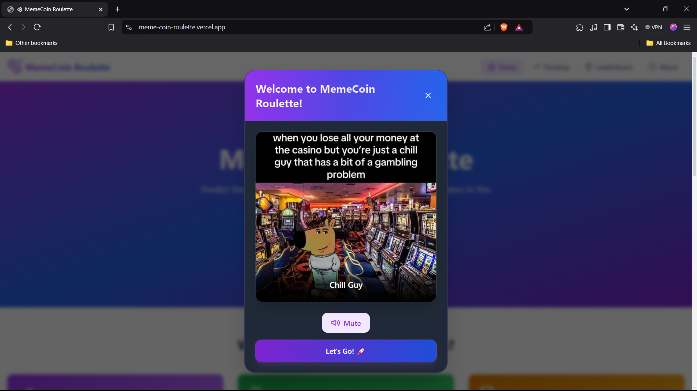
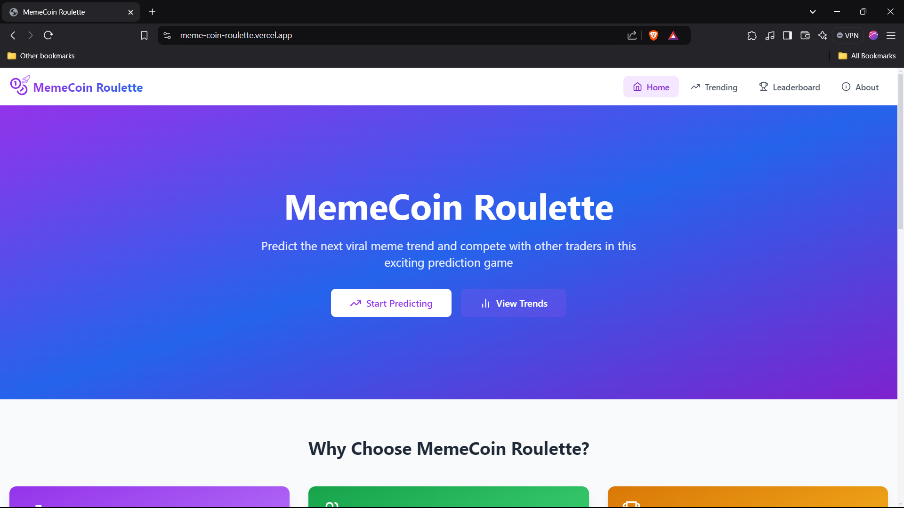
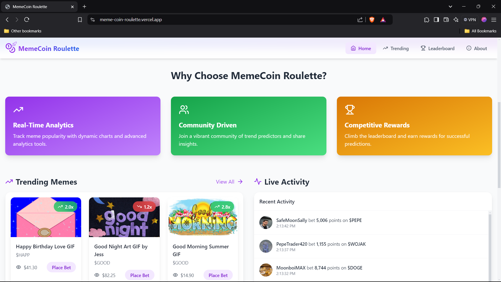
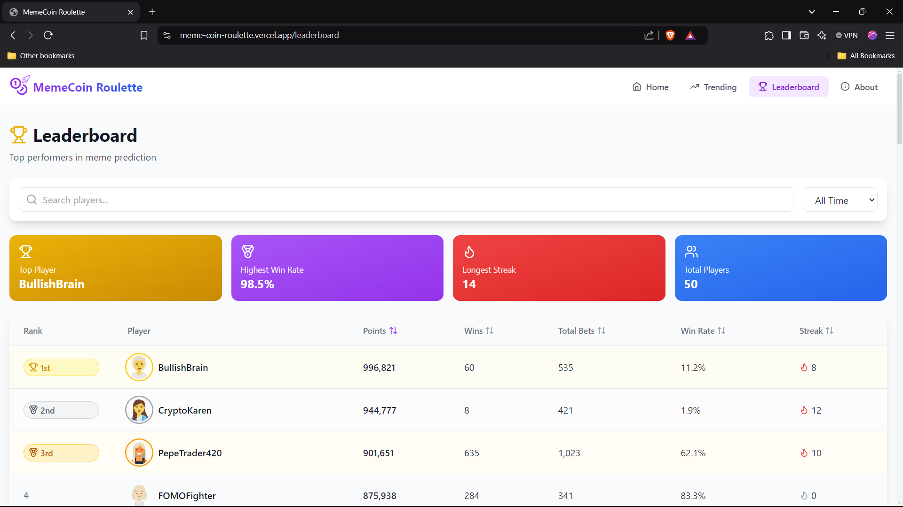
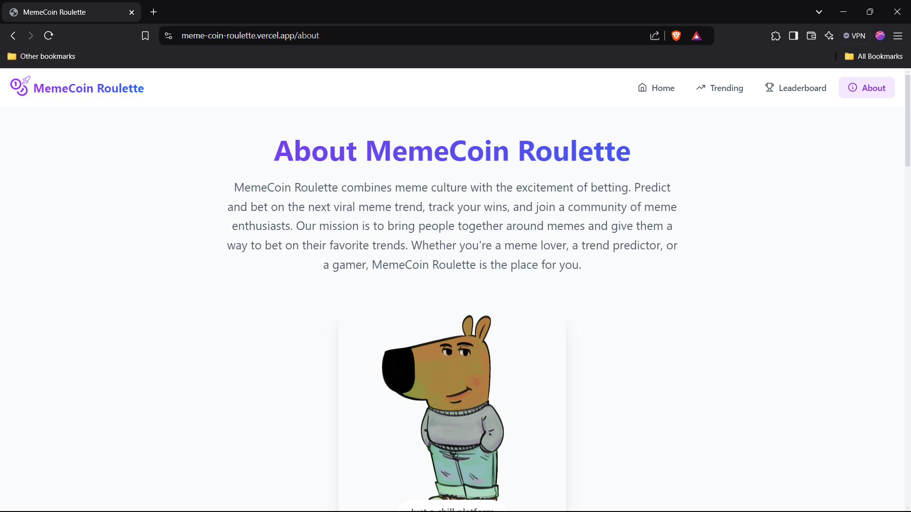

# MemeCoin Roulette

MemeCoin Roulette is an innovative and engaging web application designed for both entertainment and meme enthusiasts. Built with React, TypeScript, Tailwind CSS, and Framer Motion, this project combines the world of memes and gambling, creating a unique experience for users.

## Features

- **Welcome Popup**: Users are greeted with a random meme and an optional audio clip that plays on load. The popup lets users choose whether to enable or skip the sound for a personalized experience.
- **Trending Memes**: Displays a collection of trending memes, ensuring users stay up-to-date with the latest and most popular memes.
- **Live Feed**: A dynamic live feed shows meme-related content to keep users entertained during their session.
- **Smooth Animations**: Leveraging Framer Motion for smooth, delightful animations and transitions, enhancing the visual appeal and user interaction.
- **Responsive Design**: A fully responsive design ensures seamless functionality across various devices, from desktops to mobile phones.

## Technologies Used

- **Languages**: TypeScript, JavaScript, HTML, CSS
- **Frameworks and Libraries**: React, Tailwind CSS, Framer Motion, Lucide React
- **Build Tools**: Vite, PostCSS
- **Package Manager**: npm
- **Version Control**: Git, GitHub
- **Deployment Platform**: Vercel

## APIs and Web Technologies

- **HTML5 Audio API**: Utilized for audio playback, especially for the optional sounds accompanying memes. It enables users to control sound on/off through a simple UI.
- **Giphy API**: Integrates Giphy to fetch and display trending memes in GIF format, keeping content fresh and engaging for users.
- **Intersection Observer API**: Optimizes the performance of meme loading by lazy-loading content as it enters the viewport, improving the overall user experience.

## Getting Started

To get started with the MemeCoin Roulette application locally, follow these steps:

1. **Clone the repository**:
   ```bash
   git clone https://github.com/prem22k/MemeCoin-Roulette.git
   ```

2. **Navigate to the project directory**:
   ```bash
   cd memecoin-roulette
   ```

3. **Install the dependencies**:
   ```bash
   npm install
   ```

4. **Start the development server**:
   ```bash
   npm run dev
   ```

5. **Open your browser** and visit `http://localhost:3000` to see the application in action.

## Deployment

The application is deployed using [Vercel](https://vercel.com/), a cloud platform for hosting static sites and serverless functions. To deploy it yourself:

1. **Create a Vercel account** at [vercel.com](https://vercel.com/).
2. **Install Vercel CLI**:
   ```bash
   npm install -g vercel
   ```
3. **Login to your Vercel account**:
   ```bash
   vercel login
   ```
4. **Deploy the app**:
   ```bash
   vercel
   ```
5. **Follow the prompts** to configure deployment settings.
6. After deployment, you'll get a unique URL for your live application.

## Video Demo (Draft)

A video demonstration of the MemeCoin Roulette app will be available shortly.

## Screenshots

Here are some screenshots showcasing the features and user interface of MemeCoin Roulette:

1. 
2. 
3. 
4. 
5. 


## Contributing

We welcome contributions from everyone! If you have suggestions, improvements, or bug reports, please open an issue or submit a pull request. Be sure to follow the project’s code of conduct.

## License

This project is licensed under the [MIT License](LICENSE).

## Acknowledgements

- [React](https://reactjs.org/)
- [TypeScript](https://www.typescriptlang.org/)
- [Tailwind CSS](https://tailwindcss.com/)
- [Framer Motion](https://www.framer.com/motion/)
- [Lucide React](https://lucide.dev/docs/lucide-react)
- [Vite](https://vitejs.dev/)
- [Vercel](https://vercel.com/)
- [Giphy API](https://developers.giphy.com/)

## Contact

For any inquiries or feedback, please contact the project maintainer at [premsai224k@gmail.com](mailto:premsai224k@gmail.com).

Enjoy the MemeCoin Roulette experience!
